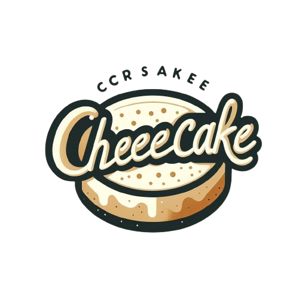
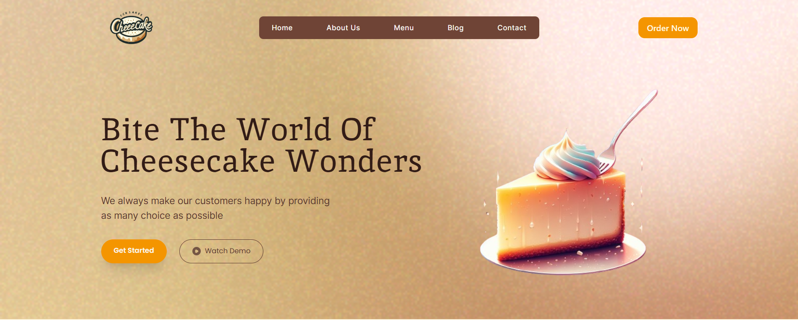

<p align="center">
<br>

<br>
<br>
</p>

<h1 align = "center"> CheeseCake Landing Page</h1>

<p align = "center">
<a href = "https://cheesecake-project.netlify.app">CheeseCake Website</a> is a responsive <strong> Landing page </strong> built with <em>mordern technologies like  <strong> HTML5, NPM (for installing packages) Tailwind CSS, Vue, CSS3 (for complex styling), Javascript (for webpage interactiveness) and GIT (for tracking changes during production) </strong></em>
<br>
<br>
<a href = "https://www.tailwindcss.com">
</a>
&nbsp;
<a href = "https://vuejs.org">

</a>
 &nbsp;
 <a href = "https://www.npmjs.com">
 
</a>
 &nbsp;
 <a href =  "https://html.spec.whatwg.org">
 
</a>
 &nbsp;
 <a href =  "https://developer.mozilla.org/en-US/docs/Web/CSS">
 
</a>
<br>
 <a href =  " https://git-scm.com">
 
</a>
 &nbsp;
 <a href =  "https://developer.mozilla.org/en-US/docs/Web/JavaScript">
 
</a>
</p>

## Description

This is a responsive landing page for a cheesecake brand. It showcases different cheesecake varieties, a simple contact form, and elegant design to attract customers.

## 🚀Features

- Clean and modern UI
- Responsive layout for all devices
- Hero section with call-to-action
- Product showcase section
- Contact form (non-functional/demo)
  <br>

  ## 🛠 Tech Stack

- HTML
- CSS
- JavaScript
- Node Package Manager (NPM)
- Taliwind css
- Vue
- GIT
  <br>

## 📂 How to Use

1. Clone the repo:
   ```bash
   git clone https://github.com/your-username/cheesecake-project.git
   ```

## Live Demo

[Click here to view](https://cheesecake-project.netlify.app/)

## 📸 Preview



## 📄 License

This project is licensed under the MIT License - see the [LICENSE](LICENSE) file for details.
